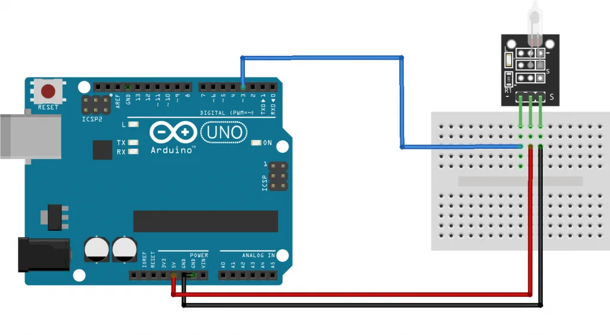
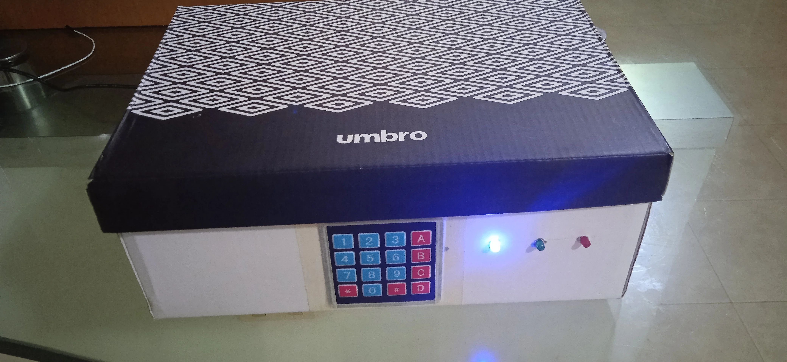

    

        <a href="https://github.com/aftsun7/safe_box/blob/main/readme_config/versions/readme_es.md"> Spanish </a>
    

    

        <a href="https://github.com/aftsun7/safe_box/blob/main/readme_config/versions/readme_pt.md"> Portuguese </a>
    

    </img>
    <h1>Safe box</h1>
    
Project developed in <a href="https://www.arduino.cc"> Arduino </a>

## Components used
- Arduino UNO
- Container (cardboard box, preferred size)
- Keypad 4x4 - Quantity: <b>1</b>
- 5V transformer - Quantity: <b>1</b>
- Led - Quantity: <b>3</b>
- Active buzzer - Quantity: <b>1</b>
- KY-017 tilt sensor - Quantity: <b>1</b>
- 220 Ω Resistors - Quantity: <b>3</b>
- Female-male dupont wires - Quantity: <b>11</b>
- Male-male dupont wires - Quantity: <b>10</b>

    <h2>Key utility table</h2>
    <table>
        <thead>
            <tr>
                <th>Key</th>
                <th>Action</th>
            </tr>
        </thead>
        <tbody>
            <tr>
                <td>A</td>
                <td>( Disarm safe box )</td>
            </tr>
            <tr>
                <td>B</td>
                <td>Set password and ( Change password )</td>
            </tr>
            <tr>
                <td>C</td>
                <td>[ Rearm safe box ]</td>
            </tr>
            <tr>
                <td>D</td>
                <td>( Reset safe box )</td>
            </tr>
        </tbody>
        <tfoot>
            <tr>
                <td><b>( )</b> Action requires password confirmation before execution</td>
            </tr>
            <tr>
                <td><b>[ ]</b> Action requires the box to be disarmed before execution</td>
            </tr>
        </tfoot>
    </table>

    <h2>Led action table</h2>
    <table>
        <thead>
            <tr>
                <th>Led</th>
                <th>Action</th>
            </tr>
        </thead>
        <tbody>
            <tr>
                <td><b>Blue</b> On</td>
                <td>Divice in operation</td>
            </tr>
            <tr>
                <td><b>Blue</b> One blink</td>
                <td>Request for memory change</td>
            </tr>
            <tr>
                <td><b>Green</b> One blink</td>
                <td>Operation completed successfully</td>
            </tr>
            <tr>
                <td><b>Green</b> Two blinks</td>
                <td>Password change request accepted</td>
            </tr>
            <tr>
                <td><b>Red</b> One blink</td>
                <td>Operation failed</td>
            </tr>
            <tr>
                <td><b>Blue + Red</b> One blink</td>
                <td>Inactive key</td>
            </tr>
        </tbody>
        <tfoot>
        </tfoot>
    </table>

    

        <h3>NOTE</h3>
        
<b>It was decided to show an individual connection diagram for the KY-017 sensor, as this sensor is not available in the Wokwi platform. However, its functionality is simulated through a "switch", which serves to replicate the two states of the original sensor.</b>

    

    

        </img>
        
General connection diagram - Full project in <a href="https://wokwi.com/projects/392372647969623041">Wokwi</a>

    

    

        </img>
        
KY-017 tilt sensor connection diagram - Source from <a href="https://arduinomodules.info/ky-017-mercury-switch-module/">ArduinoModulesInfo</a>

    

    <h3>Photographs</h3>
    </img>
    </img>

Shield: [![CC BY-SA 4.0][cc-by-sa-shield]][cc-by-sa]

This work is licensed under a
[Creative Commons Attribution-ShareAlike 4.0 International License][cc-by-sa].

[![CC BY-SA 4.0][cc-by-sa-image]][cc-by-sa]

[cc-by-sa]: http://creativecommons.org/licenses/by-sa/4.0/
[cc-by-sa-image]: https://licensebuttons.net/l/by-sa/4.0/88x31.png
[cc-by-sa-shield]: https://img.shields.io/badge/License-CC%20BY--SA%204.0-lightgrey.svg
