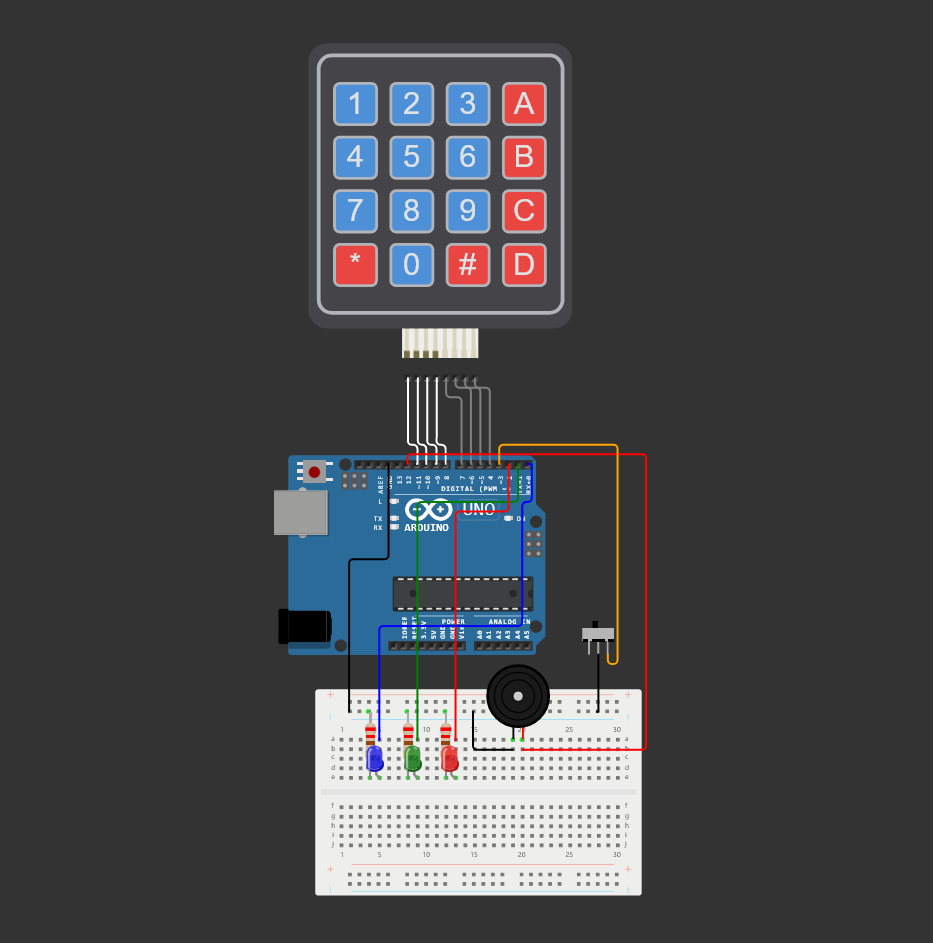
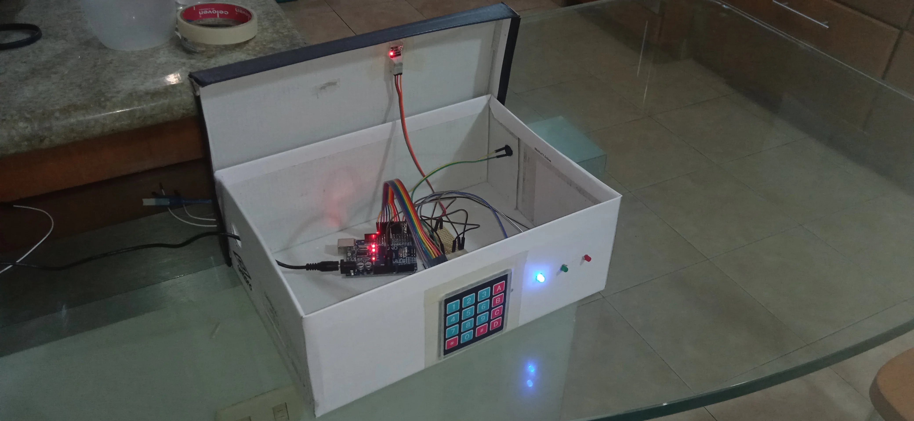

    

        <a href="https://github.com/aftsun7/safe_box/blob/main/README.md"> Inglés </a>
    

    

        <a href="https://github.com/aftsun7/safe_box/blob/main/readme_config/versions/readme_pt.md"> Portugués </a>
    

    </img>
    <h1>Caja Fuerte</h1>
    
Proyecto desarrollado en <a href="https://www.arduino.cc"> Arduino </a>

## Componentes utilizados:
- Arduino Uno
- Contendor (Caja de carton, tamaño de preferencia)
- Keypad 4x4 - Cantidad: <b>1</b>
- Transformador 5V - Cantidad: <b>1</b>
- Led - Cantidad: <b>3</b>
- Buzzer activo - Cantidad: <b>1</b>
- Sensor de inclinacion KY-017 - Cantidad: <b>1</b>
- Resistencias 220 Ω - Cantidad: <b>3</b>
- Cables dupont hembra-macho - Cantidad: <b>11</b>
- Cables dupont macho-macho - Cantidad: <b>10</b>

    <h2>Tabla de utilidad de teclas</h2>
    <table>
        <thead>
            <tr>
                <th>Tecla</th>
                <th>Accion</th>
            </tr>
        </thead>
        <tbody>
            <tr>
                <td>A</td>
                <td>( Desarmar caja fuerte )</td>
            </tr>
            <tr>
                <td>B</td>
                <td>Establecer clave y ( Cambiar clave )</td>
            </tr>
            <tr>
                <td>C</td>
                <td>[ Rearmar caja fuerte ]</td>
            </tr>
            <tr>
                <td>D</td>
                <td>( Restablecer caja fuerte )</td>
            </tr>
        </tbody>
        <tfoot>
            <tr>
                <td><b>( )</b> Acción que pide confirmar la clave antes de ejecutarse</td>
            </tr>
            <tr>
                <td><b>[ ]</b> Acción que requiere que la caja este desarmada antes de ejecutarse</td>
            </tr>
        </tfoot>
    </table>

    <h2>Tabla acciones de leds</h2>
    <table>
        <thead>
            <tr>
                <th>Led</th>
                <th>Accion</th>
            </tr>
        </thead>
        <tbody>
            <tr>
                <td><b>Azul</b> Encendido</td>
                <td>Dispositivo en funcionamiento</td>
            </tr>
            <tr>
                <td><b>Azul</b> Un parpadeo</td>
                <td>Solicitud de cambio en la memoria</td>
            </tr>
            <tr>
                <td><b>Verde</b> Un parpadeo</td>
                <td>Operacion realizada exitosamente</td>
            </tr>
            <tr>
                <td><b>Verde</b> Dos parpadeos</td>
                <td>Solicitud de cambio de clave aceptada</td>
            </tr>
            <tr>
                <td><b>Roja</b> Un parpadeo</td>
                <td>Operacion fallida</td>
            </tr>
            <tr>
                <td><b>Azul + Roja</b> Un parpadeo</td>
                <td>Tecla inactiva</td>
            </tr>
        </tbody>
        <tfoot>
        </tfoot>
    </table>

    

        <h3>NOTA</h3>
        
<b>Se opto por mostrar un diagrama de conexion individual del sensor KY-017, ya que dentro de la plataforma de Wokwi no se encuentra dicho sensor, sin embargo, se simula el funcionamiento de este por medio de un "switch" el cual cumple con la funcion de suplir los dos estados que tendria el sensor original.</b>

    

    

        </img>
        
Diagrama de conexion general - Proyecto completo en <a href="https://wokwi.com/projects/392372647969623041">Wokwi</a>

    

    

        </img>
        
Diagrama de conexion Sensor de inclinacion KY-017 - Fuente en <a href="https://arduinomodules.info/ky-017-mercury-switch-module/">ArduinoModulesInfo</a>

    

    <h3>Fotografias</h3>
    </img>
    </img>
    

Shield: [![CC BY-SA 4.0][cc-by-sa-shield]][cc-by-sa]

This work is licensed under a
[Creative Commons Attribution-ShareAlike 4.0 International License][cc-by-sa].

[![CC BY-SA 4.0][cc-by-sa-image]][cc-by-sa]

[cc-by-sa]: http://creativecommons.org/licenses/by-sa/4.0/
[cc-by-sa-image]: https://licensebuttons.net/l/by-sa/4.0/88x31.png
[cc-by-sa-shield]: https://img.shields.io/badge/License-CC%20BY--SA%204.0-lightgrey.svg
