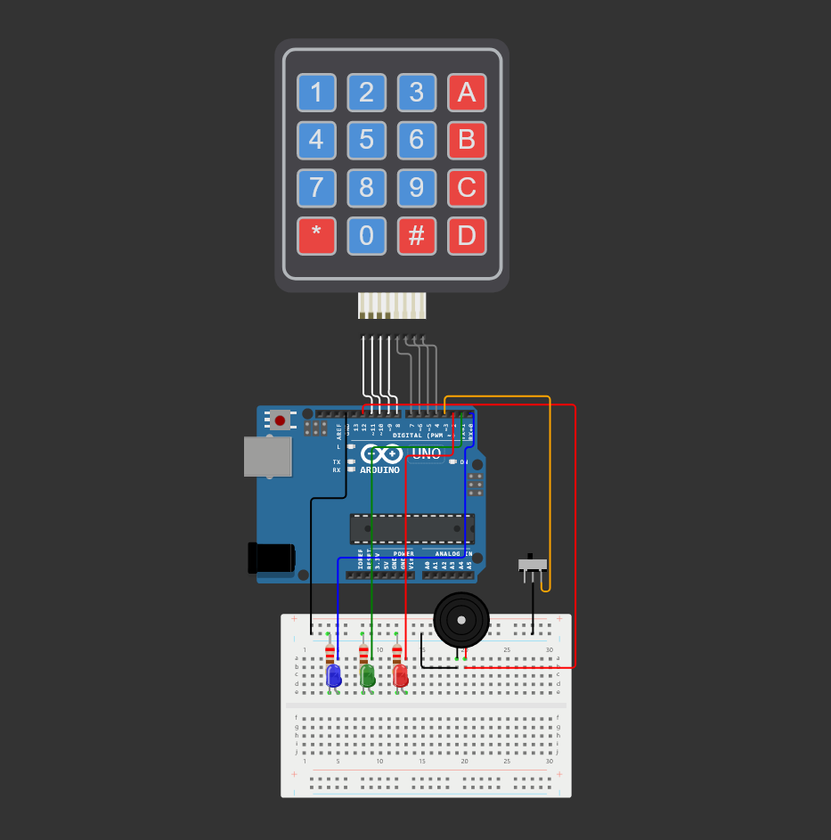
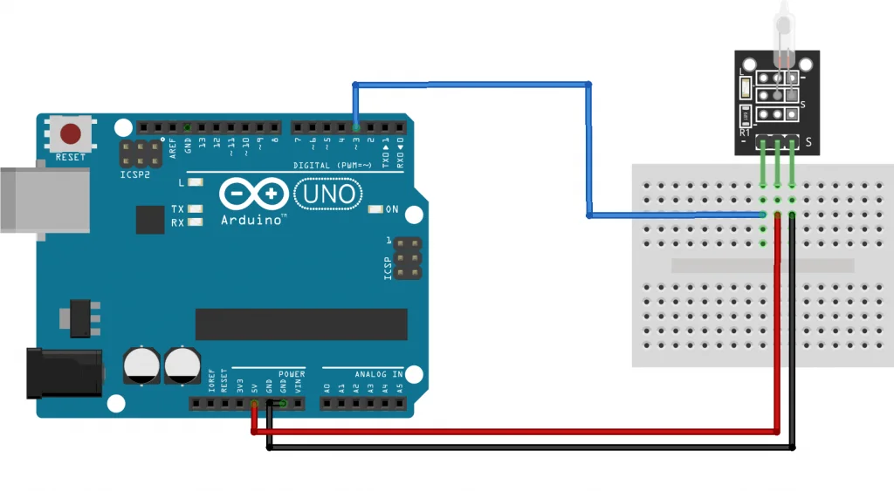
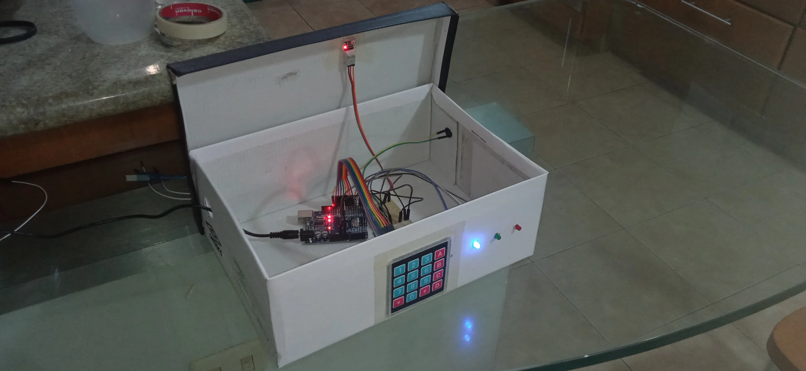
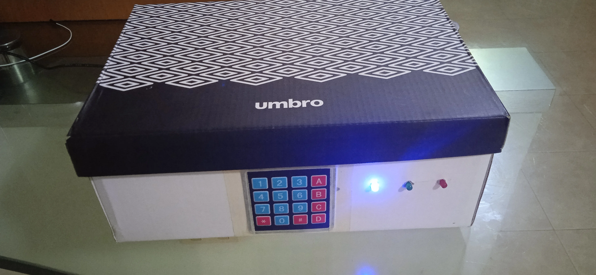

    

        <a href="https://github.com/aftsun7/safe_box/blob/main/README.md"> Inglês </a>
    

    

        <a href="https://github.com/aftsun7/safe_box/blob/main/readme_config/versions/readme_es.md"> Espanhol </a>
    

    </img>
    <h1>Cofre</h1>
    
Projeto desenvolvido em <a href="https://www.arduino.cc"> Arduino </a>

## Componentes utilizados:
- Arduino Uno
- Contêiner (caixa de papelão, tamanho preferencial)
- Teclado 4x4 - Quantidade: <b>1</b>
- Transformador 5V - Quantidade: <b>1</b>
- Led - Quantidade: <b>3</b>
- Buzzer ativo - Quantidade: <b>1</b>
- Sensor de inclinação KY-017 - Quantidade: <b>1</b>
- Resistores 220 Ω - Quantidade: <b>3</b>
- Fios dupont fêmea-macho - Quantidade: <b>11</b>
- Fios dupont macho-macho - Quantidade: <b>10</b>

    <h2>Tabela de utilidade da chave</h2>
    <table>
        <thead>
            <tr>
                <th>Chave</th>
                <th>Ação</th>
            </tr>
        </thead>
        <tbody>
            <tr>
                <td>A</td>
                <td>( Desarmar cofre )</td>
            </tr>
            <tr>
                <td>B</td>
                <td>Definir senha e ( Alterar senha )</td>
            </tr>
            <tr>
                <td>C</td>
                <td>[ Rearmar cofre ]</td>
            </tr>
            <tr>
                <td>D</td>
                <td>( Restaurar cofre )</td>
            </tr>
        </tbody>
        <tfoot>
            <tr>
                <td><b>( )</b> Ação requer confirmação de senha antes da execução</td>
            </tr>
            <tr>
                <td><b>[ ]</b> Ação requer que o cofre esteja desarmado antes da execução</td>
            </tr>
        </tfoot>
    </table>

    <h2>Tabela de ação dos leds</h2>
    <table>
        <thead>
            <tr>
                <th>Led</th>
                <th>Ação</th>
            </tr>
        </thead>
        <tbody>
            <tr>
                <td><b>Azul</b> Ligado</td>
                <td>Dispositivo em operação</td>
            </tr>
            <tr>
                <td><b>Azul</b> Um piscar</td>
                <td>Solicitação de alteração de memória</td>
            </tr>
            <tr>
                <td><b>Verde</b> Um piscar</td>
                <td>Operação concluída com sucesso</td>
            </tr>
            <tr>
                <td><b>Verde</b> Dois piscas</td>
                <td>Solicitação de alteração de senha aceita</td>
            </tr>
            <tr>
                <td><b>Vermelho</b> Um piscar</td>
                <td>Falha na operação</td>
            </tr>
            <tr>
                <td><b>Azul + Vermelho</b> Um piscar</td>
                <td>Chave inativa</td>
            </tr>
        </tbody>
        <tfoot>
        </tfoot>
    </table>

    

        <h3>NOTA</h3>
        
<b>Foi decidido mostrar um diagrama de conexão individual para o sensor não está disponível na plataforma Wokwi. No entanto, sua funcionalidade é simulada através de um "interruptor", que serve para replicar os dois estados do sensor original</b>

    

    

        </img>
        
Diagrama de conexão geral - Projeto completo no <a href="https://wokwi.com/projects/392372647969623041">Wokwi</a>

    

    

        </img>
        
Diagrama de conexão sensor de inclinação KY-017 - Fonte no <a href="https://arduinomodules.info/ky-017-mercury-switch-module/">ArduinoModulesInfo</a>

    

    <h3>Fotografias</h3>
    </img>
    </img>
    

Shield: [![CC BY-SA 4.0][cc-by-sa-shield]][cc-by-sa]

This work is licensed under a
[Creative Commons Attribution-ShareAlike 4.0 International License][cc-by-sa].

[![CC BY-SA 4.0][cc-by-sa-image]][cc-by-sa]

[cc-by-sa]: http://creativecommons.org/licenses/by-sa/4.0/
[cc-by-sa-image]: https://licensebuttons.net/l/by-sa/4.0/88x31.png
[cc-by-sa-shield]: https://img.shields.io/badge/License-CC%20BY--SA%204.0-lightgrey.svg
